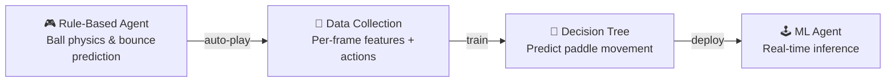
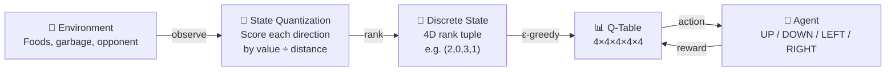
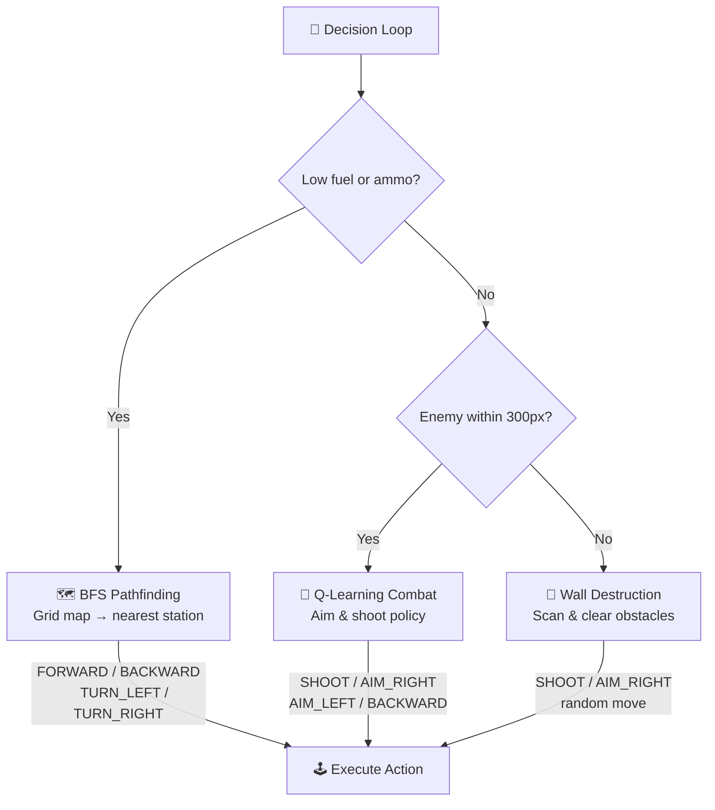

# 🕹️ neural-arcade

**ML & RL meet retro game arenas.**

Three game AI agents — each one smarter than the last — built on the [PAIA MLGame](https://github.com/PAIA-Playful-AI-Arena/MLGame) framework. From imitating an expert with a decision tree, to navigating battlefields with BFS, to learning combat strategy from scratch via Q-Learning.

[](https://www.python.org/downloads/release/python-390/)
[](https://github.com/PAIA-Playful-AI-Arena/MLGame)

---

## Projects at a Glance

| Project | Game Type | AI Approach | Key Techniques |
|---------|-----------|-------------|----------------|
| [Arkanoid](#arkanoid--supervised-learning) | Brick Breaker | Supervised ML | Physics simulation → Data collection → Decision Tree |
| [Swimming Squid](#swimming-squid--reinforcement-learning) | Competitive Foraging | Reinforcement Learning | Directional state quantization → Tabular Q-Learning |
| [TankMan](#tankman--hybrid-bfs--reinforcement-learning) | Team Tank Battle | Hybrid RL + Search | BFS pathfinding + Q-Learning combat controller |

---

## Arkanoid — Supervised Learning

A classic brick breaker where the AI learns to control the paddle by imitating a physics-based expert policy.

### Approach

The pipeline has three stages: a handcrafted script auto-plays the game using ball trajectory prediction, the resulting frame-by-frame decisions are saved as training data, and a Decision Tree classifier learns to replicate that behavior.



### State Features

The model receives these features each frame:

| Feature | Description |
|---------|-------------|
| `ball_x`, `ball_y` | Current ball position |
| `delta_x`, `delta_y` | Ball velocity vector |
| `direction` | Encoded ball direction (4 quadrants) |
| `platform_x` | Current paddle position |
| `frame` | Frame number |

### Actions

The model predicts one of three paddle commands: `MOVE_LEFT` (−1), `MOVE_RIGHT` (+1), or `NONE` (0).

### Key Design Decisions

- **Bounce prediction** accounts for wall reflections using an even/odd parity method to compute the final landing X coordinate.
- **Brick collision** is considered — the agent simulates ball reflection off bricks to adjust the predicted landing point.
- **Randomized thresholds** in the expert script add natural variance to the training data, improving model robustness.

📂 **[View game rules & details →](./arkanoid/README.md)**

---

## Swimming Squid — Reinforcement Learning

A competitive 2-player ocean foraging game. Each squid eats food for points, avoids garbage, and can collide with the opponent for bonus/penalty scoring. The agent learns an optimal movement policy entirely through Q-Learning.

### Approach

The environment is discretized by computing a weighted score for each of the four movement directions (food value divided by distance, plus opponent threat), then ranking those scores into a compact state tuple. A tabular Q-Learning agent explores this state space over 150 training rounds with decaying ε-greedy exploration.



### State Representation

Each frame, the agent processes all visible food and the opponent into four directional buckets (UP, DOWN, LEFT, RIGHT). Items are scored by `value / (distance + 1)` and summed per direction. The four sums are then **rank-ordered** (0–3), producing a compact 4D state.

### Training Configuration

| Parameter | Value | Strategy |
|-----------|-------|----------|
| State space | 4⁴ × 4 = 1,024 entries | Rank-based discretization |
| Exploration (ε) | 1.0 → 0.01 | Linear decay over 150 rounds |
| Learning rate (α) | 1.0 → 0.01 | Linear decay over 150 rounds |
| Discount (γ) | 0.9 | — |

### Reward Shaping

The reward is based on alignment between the chosen action and the optimal direction ranking — the agent receives higher reward for moving toward the direction with the best score.

📂 **[View game rules & details →](./swimming-squid/README.md)**

---

## TankMan — Hybrid BFS + Reinforcement Learning

A team-based tank battle game combining **BFS pathfinding** for resource management with **Q-Learning** for combat aiming. The agent switches between two behavioral modes depending on the tactical situation.

### Approach

The agent operates a priority-based decision loop: when fuel or ammo is low, it uses BFS on a discretized grid map to navigate to the nearest supply station. When an enemy is within range, it switches to a Q-Learning policy that controls turret aiming and firing decisions.



### BFS Navigation

The map is discretized into a 50×30 grid. Walls, stations, teammates, and enemies are projected onto this grid. The BFS search operates in a 3D state space `(row, col, angle)` — considering the tank's facing direction — and returns the shortest path to the nearest fuel or bullet station.

### Q-Learning Combat Controller

When an enemy enters range, the agent computes a state vector for the Q-table:

| State Dimension | Values | Description |
|-----------------|--------|-------------|
| `angle_diff` | 0–8 | Discretized angle between gun and enemy (45° bins) |
| `turning_direction` | 0–1 | Clockwise vs. counter-clockwise to target |
| `is_cooldown` | 0–1 | Whether the gun is on cooldown |
| `teammate_angle_diff` | 0–8 | Angle to nearest teammate (friendly fire avoidance) |

The Q-table has shape `(9, 2, 2, 9, 5)` mapping states to five actions: SHOOT, AIM_RIGHT, AIM_LEFT, BACKWARD, and a fallback wall-destruction mode.

### Training Configuration

| Parameter | Value | Strategy |
|-----------|-------|----------|
| State space | 9×2×2×9×5 = 1,620 entries | Angle-based discretization |
| Exploration (ε) | 1.0 → 0.01 | Linear decay over 170 rounds |
| Learning rate (α) | 1.0 → 0.01 | Linear decay over 170 rounds |
| Discount (γ) | 0.9 | — |

📂 **[View game rules & details →](./tankman/README.md)**

---

## Tech Stack

- **Language:** Python 3.9
- **Game Framework:** [PAIA MLGame](https://github.com/PAIA-Playful-AI-Arena/MLGame), Pygame 2.0.1
- **ML/RL:** NumPy (tabular Q-Learning), scikit-learn (Decision Tree)
- **Pathfinding:** Custom BFS with directional state space
- **Serialization:** Pickle (Q-tables and trained models)

---

## Repository Structure (ML/RL related files)

```
.
├── README.md                  # ← You are here
├── arkanoid/
│   ├── README.md              # Game rules & details
│   └── ml/
│       ├── ml_play_template.py        # Rule-based expert + data collection
│       └── ml_play_model.py           # Trained Decision Tree agent
├── swimming-squid/
│   ├── README.md              # Game rules & details
│   └── ml/
│       ├── handleData.py              # State quantization + Q-Learning class
│       ├── Qlearning.py               # Training script
│       └── model_play.py              # Trained Q-table agent
└── tankman/
    ├── README.md              # Game rules & details
    └── ml/
        ├── data_handler.py            # State processing + Q-Learning class
        ├── find_station.py            # BFS pathfinder
        ├── wall_handler.py            # Wall detection & destruction
        ├── trainQL_play.py            # Training script
        └── ml_model_play.py           # Trained hybrid agent
```

---

## How to Run

```bash
# Install dependencies
pip install mlgame pygame numpy scikit-learn

# Run any game with its AI agent
python -m mlgame -i ./ml/ml_play_model.py ./ --level <N>
```

See each project's README for game-specific configuration and level options.

---

## Author

**Harris** — Built as a portfolio exploring the progression from rule-based AI to reinforcement learning in competitive game environments.